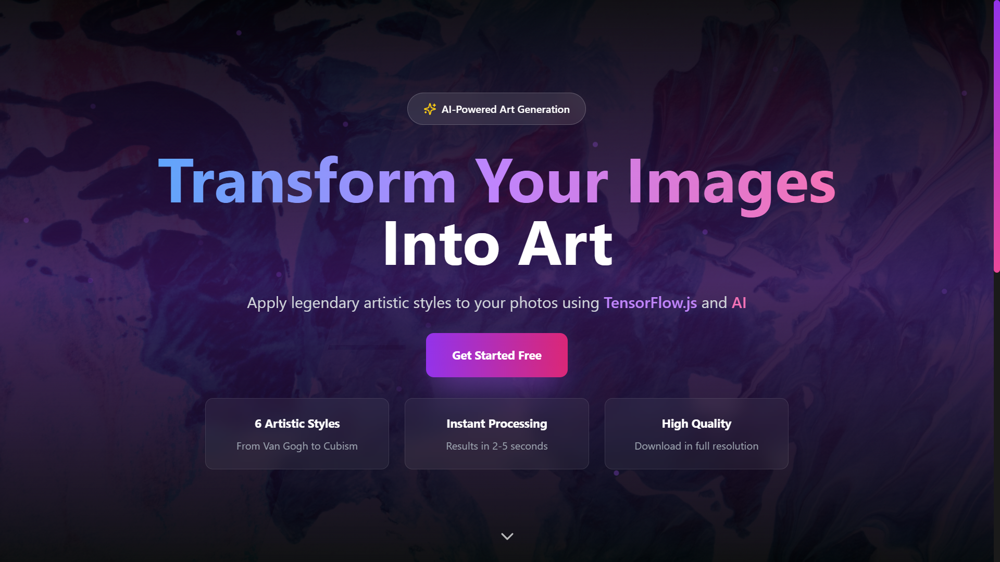
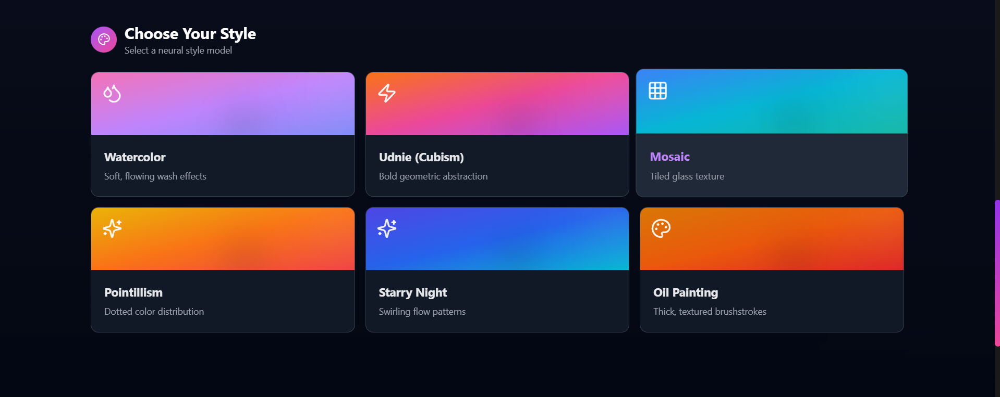
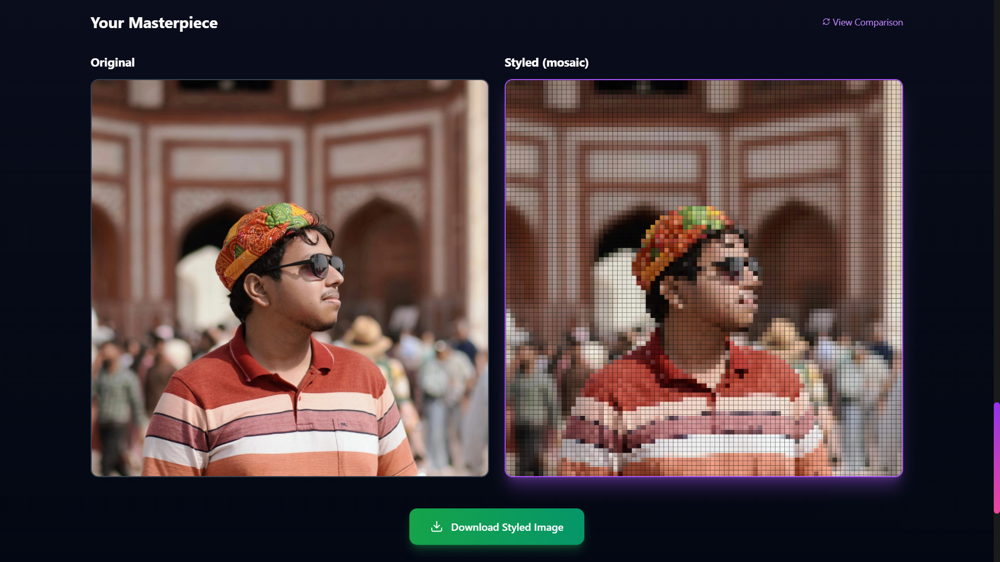

# AI Style Transfer Web App

Transform your photos into stunning artworks using advanced AI technology. Apply legendary artistic styles like Van Gogh, Picasso, and more to your images in seconds with this modern web application.

## Features

- **AI-Powered Style Transfer**: Utilize TensorFlow.js for client-side neural style transfer
- **Multiple Artistic Styles**: Choose from a variety of pre-trained artistic styles
- **Real-time Processing**: See your images transform instantly in the browser
- **Image Upload & Preview**: Easy drag-and-drop image uploading with live preview
- **Side-by-Side Comparison**: Compare original and styled images
- **Download Results**: Save your artistic creations as high-quality images
- **Responsive Design**: Works seamlessly on desktop and mobile devices
- **Modern UI**: Built with React, Tailwind CSS, and Framer Motion for smooth animations

## Tech Stack

### Frontend
- **React 18** - Modern JavaScript library for building user interfaces
- **Vite** - Fast build tool and development server
- **TensorFlow.js** - Machine learning in the browser
- **Tailwind CSS** - Utility-first CSS framework
- **Framer Motion** - Animation library for React
- **Radix UI** - Accessible UI components
- **Lucide React** - Beautiful icons

### Backend
- **Flask** - Lightweight Python web framework
- **Docker** - Containerization for easy deployment

## Installation

### Prerequisites
- Node.js (v16 or higher)
- npm or yarn
- Python 3.8+ (for backend)
- Docker (optional, for containerized deployment)

### Frontend Setup

1. Clone the repository:
   ```bash
   git clone <repository-url>
   cd image-style-transfer
   ```

2. Install dependencies:
   ```bash
   npm install
   ```

3. Start the development server:
   ```bash
   npm run dev
   ```

4. Open your browser and navigate to `http://localhost:3000`

### Backend Setup

1. Navigate to the backend directory:
   ```bash
   cd backend
   ```

2. Create a virtual environment:
   ```bash
   python -m venv venv
   source venv/bin/activate  # On Windows: venv\Scripts\activate
   ```

3. Install Python dependencies:
   ```bash
   pip install -r requirements.txt
   ```

4. Run the Flask server:
   ```bash
   python app.py
   ```

### Docker Deployment (Optional)

1. Build the Docker image:
   ```bash
   docker build -t style-transfer-backend .
   ```

2. Run the container:
   ```bash
   docker run -p 5000:5000 style-transfer-backend
   ```

## Usage

1. **Upload an Image**: Drag and drop or click to select an image from your device
2. **Choose a Style**: Browse through available artistic styles and select one
3. **Generate Artwork**: Click the "Generate Artwork" button to apply the style transfer
4. **View Results**: See the side-by-side comparison of your original and styled image
5. **Download**: Save your masterpiece to your device

## Screenshots

### Frontend Interface

*Main application interface showing the hero section and style transfer controls*

### Style Options

*Available artistic styles for selection*

### Output Image

*Example of style transfer result with before/after comparison*


## Contributing

We welcome contributions! Please follow these steps:

1. Fork the repository
2. Create a feature branch: `git checkout -b feature/your-feature-name`
3. Commit your changes: `git commit -m 'Add some feature'`
4. Push to the branch: `git push origin feature/your-feature-name`
5. Open a pull request

## License

This project is licensed under the MIT License - see the [LICENSE](LICENSE) file for details.

## Acknowledgments

- TensorFlow.js team for the amazing machine learning library
- Artistic style transfer research community
- Open source contributors
